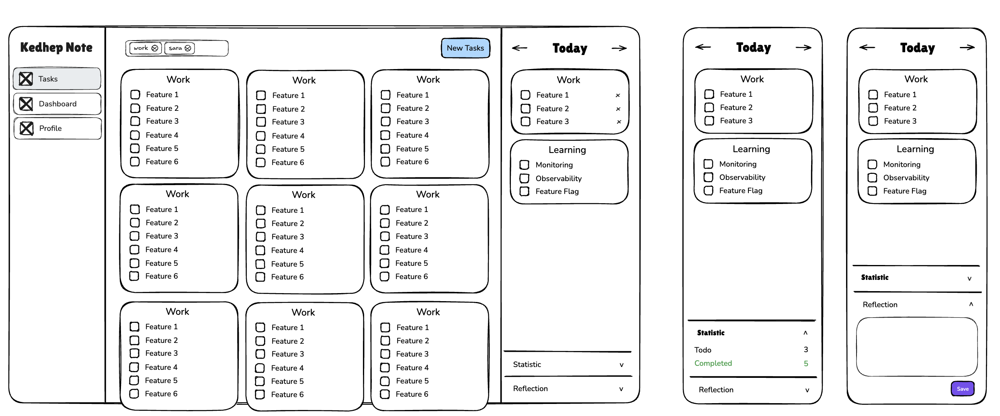

# Kedhep Note
Kedhep Note is a productivity web app designed to help you capture everything on your mind—tasks, ideas, and plans—so nothing gets lost. Easily organize, prioritize, and select which tasks you want to focus on today. Built with [Next.js](https://nextjs.org), Tailwind CSS, and a modern component-based architecture, Kedhep Note streamlines your workflow and adapts seamlessly across devices.



## Features

- **Task Management:** Organize tasks by category (e.g., Work, Learning) with checklists.
- **Dashboard:** Visualize your daily progress and statistics.
- **Reflection:** Add daily reflections to track your growth.
- **Responsive Design:** Optimized for both desktop and mobile devices.
- **Dark Mode:** Seamless theme switching for comfortable viewing.

## Getting Started

### Prerequisites

- [Node.js](https://nodejs.org/) (v18+ recommended)
- [pnpm](https://pnpm.io/) or npm/yarn

### Installation

Clone the repository and install dependencies:

```sh
git clone https://github.com/yourusername/kedhep-note.git
cd kedhep-note
pnpm install
# or
npm install
# or
yarn install
```

### Development

Start the development server:

```sh
pnpm dev
# or
npm run dev
# or
yarn dev
```

Open [http://localhost:3000](http://localhost:3000) in your browser to view the app.

### Building for Production

```sh
pnpm build
# or
npm run build
# or
yarn build
```

### Linting

```sh
pnpm lint
# or
npm run lint
# or
yarn lint
```

## Project Structure

```
src/
  app/           # Next.js app directory (pages, layouts, etc.)
  lib/           # Shared utilities and logic
public/          # Static assets (SVGs, images)
```

## Technologies Used

- [Next.js](https://nextjs.org/)
- [Tailwind CSS](https://tailwindcss.com/)
- [PostCSS](https://postcss.org/)
- [TypeScript](https://www.typescriptlang.org/)

## Contributing

Contributions are welcome! Please open issues or pull requests for suggestions and improvements.

## License

This project is licensed under the MIT License.

---

> Inspired by productivity tools and designed for personal and professional growth.